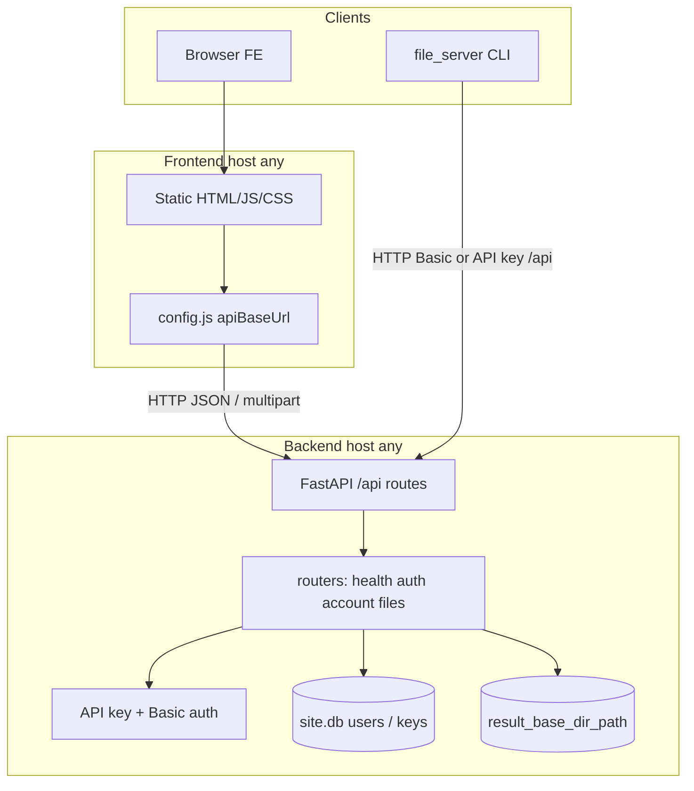

# File-Server

## API / GUI split (plugin mode)

The repo now includes a separable backend and frontend:

- [`backend/`](backend/) — FastAPI only (`/api/*`)
- [`frontend/`](frontend/) — static terminal-style UI that talks **only** to those APIs

### Architecture



```bash
# Terminal 1 — backend (any host)
cd backend && pip install -r requirements.txt && python run.py

# Terminal 2 — frontend
# edit frontend/config.js → apiBaseUrl if the API is remote
cd frontend && python serve.py
```

Open `http://localhost:8080` and set `window.FILE_SERVER.apiBaseUrl` in [`frontend/config.js`](frontend/config.js) to point at any backend host. Details: [`backend/README.md`](backend/README.md), [`frontend/README.md`](frontend/README.md).

Frontend features (parity with classic GUI): browse, upload, download, replace, rename, delete, preview/thumbnail, login/register, account/password, about.

---

This application extends how you browse and share files on a server: use the **terminal-style web UI**, **REST API** (Swagger at `/docs`), or **CLI** (`file_server`).

**Current stack:** [`backend/`](backend/) is **FastAPI + SQLModel** (API-only). [`frontend/`](frontend/) is static HTML/JS that talks only to `/api/*`. The classic Flask monolith under [`src/`](src/) is legacy; new work uses the split layout above.

**Users & permissions:** Log in with username/password (session API key) or a long-lived API key. Any **logged-in user** can upload, replace, rename, and mkdir. Delete is gated by `allow_delete` in config.

**File types:** By default all extensions are allowed (`supported_file_extension` is `[]`). Restrict types via [`backend/src/config.py`](backend/src/config.py) or env vars such as `FS_SUPPORTED_FILE_EXTENSION` / `FS_NON_SUPPORTED_FILE_EXTENSION`.

# A simple use case

Teams in different regions share build artifacts and test results through the **web UI** (`:8080`). Automation uses the **REST API** (`:5000`, Swagger at `/docs`) with API keys or HTTP Basic. Folders under `result_base_dir_path` are browsed by **path** (e.g. `Product1/01/Sub_Product1/category1`) instead of separate `product` / `version` query flags.

---

# Deployment

## Quick start (host)

```bash
# Backend — API on :5000
cd backend
python3 -m venv .venv && source .venv/bin/activate
pip install -r requirements.txt
export FS_RESULT_BASE_DIR_PATH=/path/to/share   # optional
python run.py

# Frontend — UI on :8080
cd frontend
# edit config.js → apiBaseUrl if backend is not localhost:5000
python serve.py
```

Or use [`deploy_on_host.sh`](deploy_on_host.sh) as a starting point (adjust paths and env vars).

## Create a user

Register via the UI when `allow_registrations` is enabled.

## Containers

| Script | Service | Port |
|--------|---------|------|
| [`deployments/deploy_backend_in_container.sh`](deployments/deploy_backend_in_container.sh) | FastAPI backend | 5000 |
| [`deployments/deploy_frontend_in_container.sh`](deployments/deploy_frontend_in_container.sh) | Static frontend | 8080 (check image) |
| [`deployments/cli/build.sh`](deployments/cli/build.sh) | CLI client image (no server) | — |

CLI image docs: [`deployments/cli/README.md`](deployments/cli/README.md). Upload/replace need a volume mount, e.g. `-v "$(pwd):/work:Z" -w /work`.

Mount your data directory when running the backend container, e.g. `-v /host/share:/data:Z` and set `FS_RESULT_BASE_DIR_PATH=/data`.

**Note:** Backend defaults to port **5000**; frontend defaults to **8080**.

---

# Configuration

Settings live in [`backend/src/config.py`](backend/src/config.py) (`Settings` class). Override with environment variables prefixed `FS_` or a `backend/.env` file.

| Setting | Env var | Description |
|---------|---------|-------------|
| `result_base_dir_path` | `FS_RESULT_BASE_DIR_PATH` | Filesystem root for browse/upload/download |
| `port` | `FS_PORT` | API listen port (default `5000`) |
| `allow_registrations` | `FS_ALLOW_REGISTRATIONS` | Allow `POST /api/register` and UI register page |
| `allow_delete` | `FS_ALLOW_DELETE` | Allow delete API and UI delete actions |
| `enable_api_keys` | `FS_ENABLE_API_KEYS` | API-key login and account key management |
| `supported_file_extension` | `FS_SUPPORTED_FILE_EXTENSION` | Allow-list extensions; empty = all types |
| `non_supported_file_extension` | `FS_NON_SUPPORTED_FILE_EXTENSION` | Block-list extensions |
| `cors_origins` | `FS_CORS_ORIGINS` | Browser origins allowed to call the API |
| `database_url` | `FS_DATABASE_URL` | SQLite URL; default `backend/src/site.db` |
| `data_retention_days` | `FS_DATA_RETENTION_DAYS` | Delete files older than this many days (default `90`; `0` disables) |
| `cleanup_interval_hours` | `FS_CLEANUP_INTERVAL_HOURS` | How often the retention sweep runs (default `24`) |
| `cleanup_exclude_dirs` | `FS_CLEANUP_EXCLUDE_DIRS` | JSON list of share-relative dirs never cleaned, e.g. `["keep","Product1/golden"]` |

---

# Frontend URLs (port 8080)

The frontend uses **pretty URLs** (no `.html` in the address bar). Point [`frontend/config.js`](frontend/config.js) at your API:

```js
window.FILE_SERVER = { apiBaseUrl: "http://127.0.0.1:5000" };
```

| URL | Purpose |
|-----|---------|
| `/` | Browse home (`~` = `result_base_dir_path`) |
| `/about` | README / architecture |
| `/login` | Login (password → session API key) |
| `/register` | Register (*if enabled*) |
| `/account` | Profile, password, API keys |
| `/upload` | Upload files (auth required) |
| `/replace` | Replace by file name (auth required) |
| `/delete` | Delete by file name (*if `allow_delete`*) |

Browse uses `?path=folder/subfolder` on the home URL. Sidebar **Places** mirror these routes.

---

# REST API (port 5000)

Interactive docs: `http://<host>:5000/docs`

## Authentication

1. **API key (browser / automation)** — `POST /api/login` with `{username, password}` returns a `token` (`fs_…` session key), or send an existing key. Use `Authorization: Bearer <key>` or header `X-API-Key: <key>`.
2. **HTTP Basic** — still supported for the CLI and automation (`username` + `password`).

Create long-lived keys under `/api/account/api-keys` (revoked when you change password or username/email).

## Endpoints

| Method | Path | Auth | Purpose |
|--------|------|------|---------|
| GET | `/api/health` | no | Liveness |
| GET | `/api/meta` | no | `allow_registrations`, `allow_delete`, `result_base_dir_path`, … |
| GET | `/api/about` | no | README markdown |
| POST | `/api/login` | no | Password or `{api_key}` login |
| POST | `/api/register` | no* | Create account (*if enabled*) |
| GET | `/api/me` | yes | Current user |
| POST | `/api/account` | yes | Update username/email (revokes all API keys) |
| POST | `/api/account/password` | yes | Change password (revokes all API keys) |
| GET/POST/DELETE | `/api/account/api-keys` | yes | Manage API keys |
| GET | `/api` | no | List top-level folders (products) |
| GET | `/api/download?path=&file=` | yes | List path or download file |
| GET | `/api/preview?path=` | yes | Inline file preview |
| GET | `/api/thumbnail?path=` | yes | JPEG thumbnail (images/video) |
| POST | `/api/upload?path=&comment=` | yes | Multipart upload (`file` field, multi-file OK) |
| POST | `/api/replace?file_to_replace=&file_number=` | yes | Replace file (multipart `file`) |
| POST | `/api/rename` | yes | JSON `{path, new_name}` |
| POST | `/api/mkdir` | yes | JSON `{path, name}` |
| POST | `/api/delete` | yes* | JSON `{path}` or `{file_to_delete, file_number}` (*if `allow_delete`*) |

## Path-based parameters

Paths are relative to `result_base_dir_path`, using `/` separators (same idea as folders on disk):

| Concept | Example path |
|---------|----------------|
| Product (top folder) | `Product1` |
| Product + version | `Product1/01` |
| Deeper tree | `Product1/01/Sub_Product1/category3/sub_category_3` |
| File inside path | use `path` + `file` on download, or full file path on rename/delete |

**List root folders**

```bash
curl -s http://127.0.0.1:5000/api
# {"products":["Product1","Product2",...]}
```

**List a directory**

```bash
curl -s -u admin:secret \
  'http://127.0.0.1:5000/api/download?path=Product1/01'
```

**Download a file**

```bash
curl -s -u admin:secret -OJ \
  'http://127.0.0.1:5000/api/download?path=Product1/01&file=report.xml'
```

**Upload with API key**

```bash
TOKEN=$(curl -s -X POST http://127.0.0.1:5000/api/login \
  -H 'Content-Type: application/json' \
  -d '{"username":"admin","password":"secret"}' | jq -r .token)

curl -s -X POST \
  -H "Authorization: Bearer $TOKEN" \
  -F "file=@report.xml" \
  'http://127.0.0.1:5000/api/upload?path=Product1/01&comment=CI%20run'
```

**Replace a file**

```bash
curl -s -X POST -u admin:secret \
  -F "file=@report-new.xml" \
  'http://127.0.0.1:5000/api/replace?file_to_replace=report.xml&file_number=1'
```

**Create folder**

```bash
curl -s -X POST -H "Authorization: Bearer $TOKEN" \
  -H 'Content-Type: application/json' \
  -d '{"path":"Product1/01","name":"new_folder"}' \
  http://127.0.0.1:5000/api/mkdir
```

---

# CLI and automation

Single script [`file_server`](file_server) — install deps once:

```bash
pip install -r requirements-cli.txt
chmod +x file_server
# optional: sudo cp file_server /usr/local/bin/file-server
```

Auth: **API key** (`-k` / `FS_API_KEY`) or **Basic** (`-U` / `-P` or `FS_USERNAME` / `FS_PASSWORD`). Host: `FS_HOST` or `--host`.

```bash
./file_server download -k "$FS_API_KEY"
./file_server download --path Product1/01 -f report.xml
./file_server upload --path Product1/01 -f report.xml --comment "CI run"
./file_server upload --path a/b/c/d -f report.xml --auto-create-dir
./file_server replace -o report.xml -f report-new.xml
```
---

